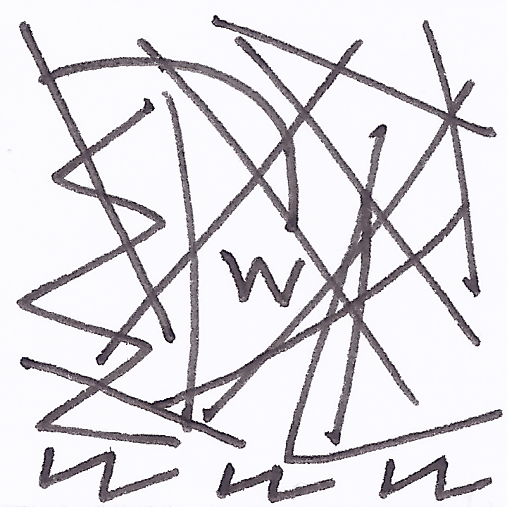
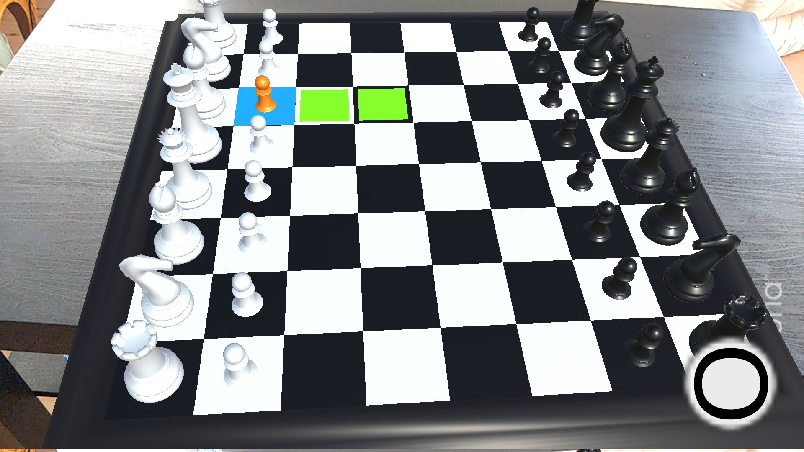
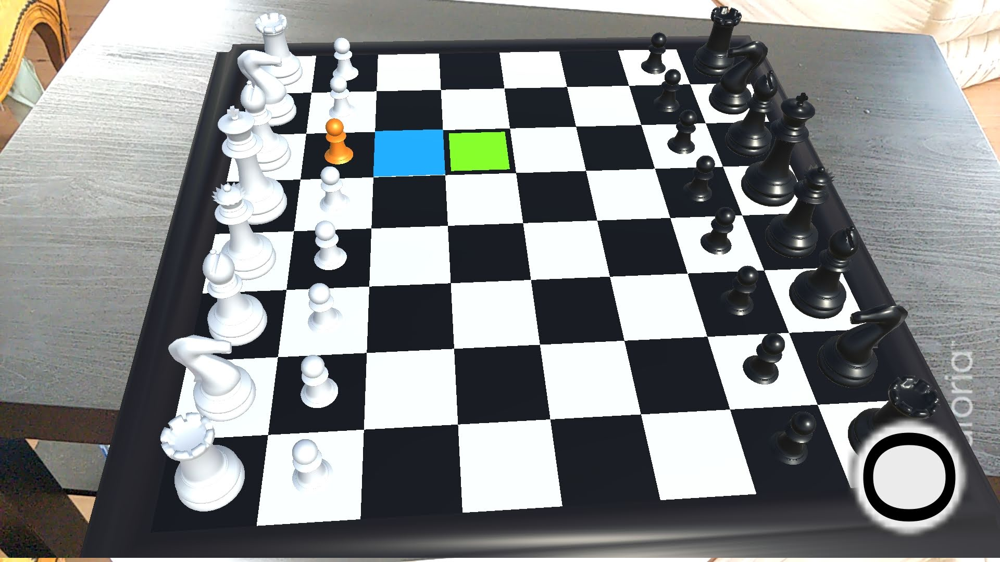
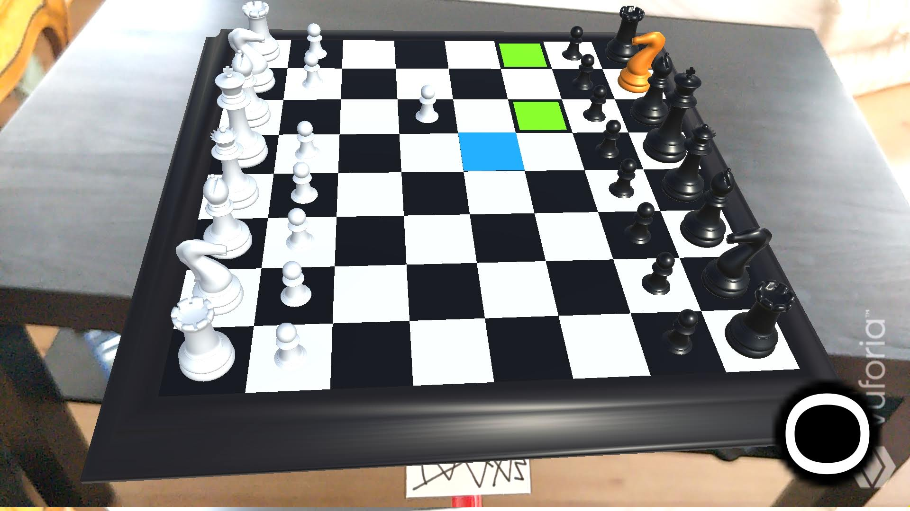

# AR-Chessboard

Chess game in augmented reality, built with Unity and Vuforia

## How to play?

The app can detect plane areas and can pose the chessboard on any plane area only by touching the screen.
Print the image target below in small format, and tie it on a pencil or a pen:

The pen with the image target is used to select pieces and chessboard squares by moving the pencil under the chessboard, and the button on the screen is used to validate the piece or the move.

The color of the button indicates the current player.

## Screenshots

### Report
https://mallarde.iiens.net/S4/IRA/Rapport_Projet_RA.pdf